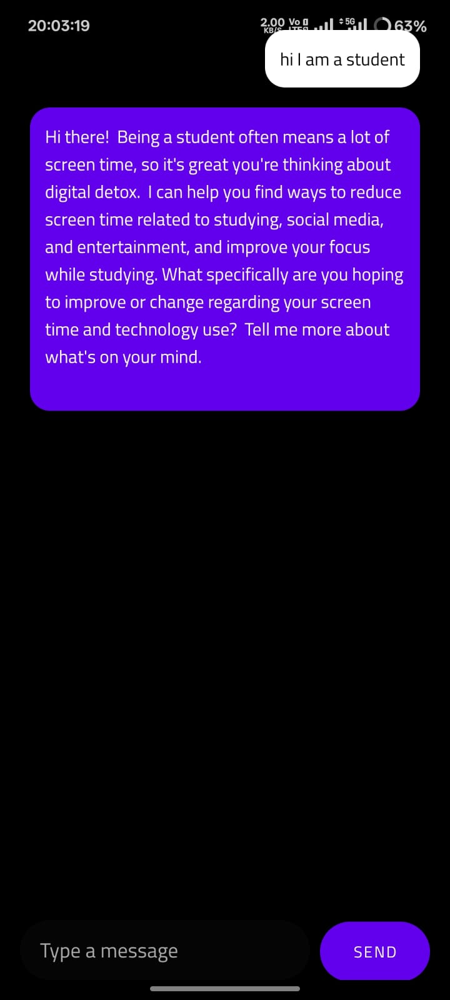
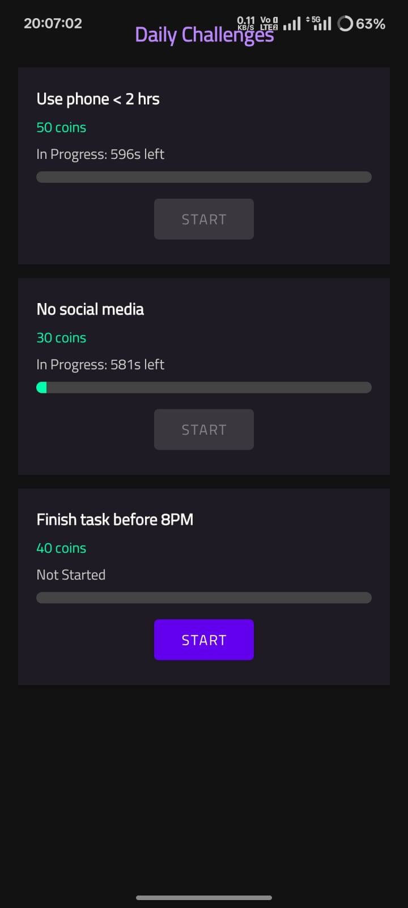
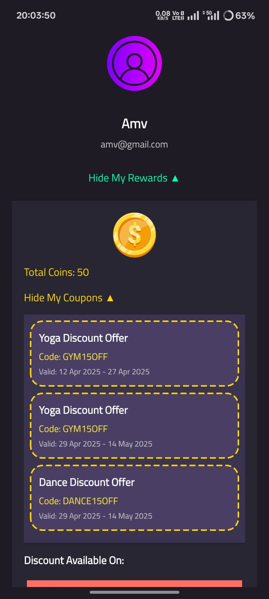
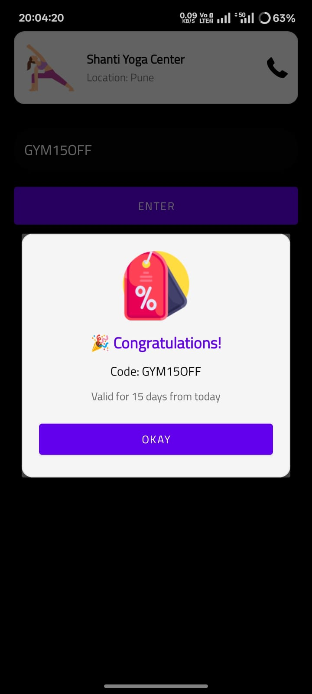
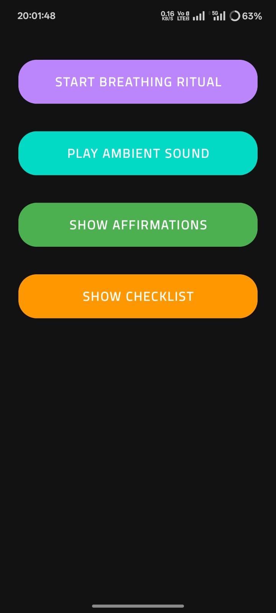
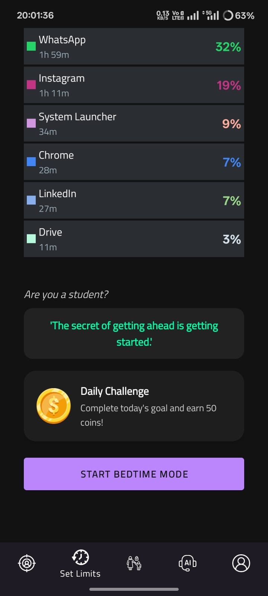

# 📵 DigitalDetox – Mindful Mobile Usage App

**Healthy Digital Habits | Hackathon Finalist**

**DigitalDetox** is an Android application developed during a national-level hackathon to promote healthier digital habits. The app encourages mindful mobile usage through customizable restrictions, reminders, and gamified interventions.

> 📁 **Note:** This is a showcase repository. For access to the full source code, please contact me directly.

---

## 🚀 Problem Statement

*Digital Detox – Manage Your Mobile Time*  
> Design an Android app that helps users reduce mobile addiction, enforce mindful breaks, and improve productivity.

---

## 🌟 Key Features

- ⏱️ **Screen Time Dashboard** – Visualize daily and weekly screen usage  
- 😴 **Bedtime & Focus Modes** – Reduce distractions during sleep or work  
- 🧘 **Breathing & Affirmation Tools** – Provide mental calmness and clarity  
- 🏆 **Gamified Detoxing** – Track progress through rewards, coupons, and challenges  
- 👨‍🎓 **Student Mode** – Dedicated tools like study tips and focus rituals  
- 🔐 **Permissions Control** – Secure device access for monitoring  
- 💬 **AI Chatbot** – Motivates users to maintain mindful usage

---

## 🛠 Tech Stack

- **Language:** Kotlin, XML  
- **UI Framework:** Jetpack Compose  
- **Architecture:** MVVM  
- **Tools:** Android Studio, Firebase (Realtime DB)

---

## 📸 Screenshots

### 🏠 Main Functionalities

| Home | Weekly Screen Time | App List | Focus Mode |
|------|--------------------|----------|------------|
|  |  |  |  |

### 😴 Focus and Wellness

| Breathing Mode | Affirmations | Bedtime Mode | Chatbot |
|----------------|--------------|--------------|---------|
|  |  |  |  |

### 🧩 Rewards, Challenges & Tools

| Daily Challenges | Coupons | Coupon Use | Rewards |
|------------------|---------|-------------|---------|
|  |  |  |  |

### 🎓 Student Productivity Suite

| Student Tools | Focus Rituals | Features for Students |
|---------------|----------------|------------------------|
|  |  |  |

> 🧠 For additional UI details, refer to the [`assets/screenshots/`](assets/screenshots/) folder.

---

## 🏆 Recognition

🏁 **Finalist** – National Level Hackathon  
Recognized for innovation in digital wellness through behavior-driven mobile design.

---

## 👨‍💻 Developer

**Aniket Vyavhare**  
📧 amvyavhare@gmail.com  
🔗 [GitHub](https://github.com/am-vyavhare) | [LinkedIn](https://www.linkedin.com/in/aniket-vyavhare/)
