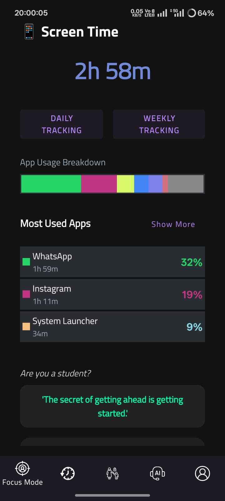
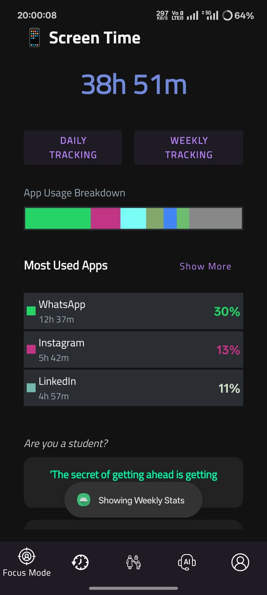
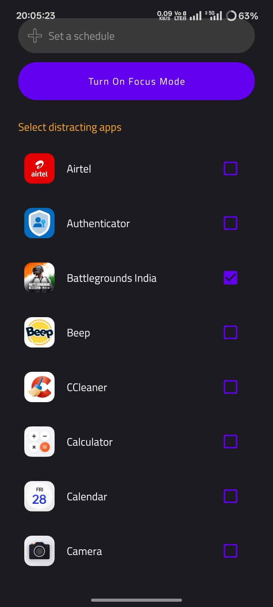
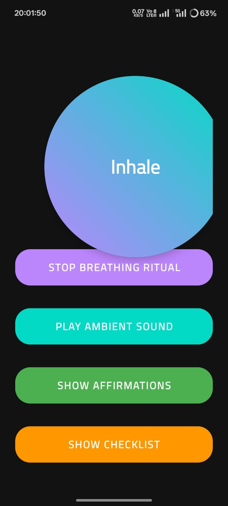
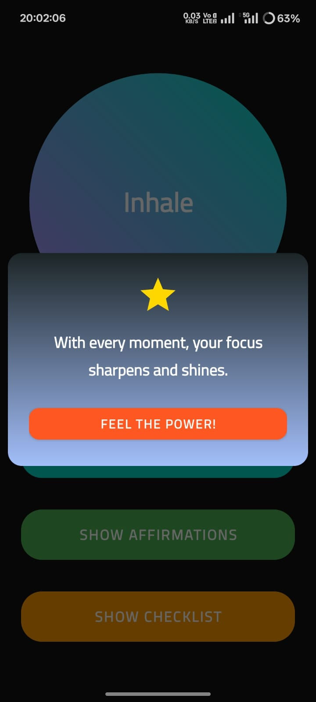
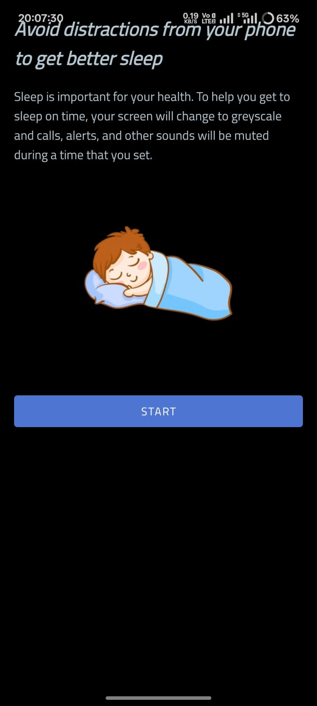
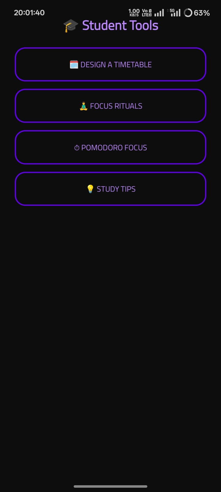

# 📵 DigitalDetox – Mindful Mobile Usage App

**Healthy Digital Habits | Hackathon Finalist**

**DigitalDetox** is an Android application developed for a national-level hackathon to promote healthier digital habits. It empowers users to take control of their screen time through reminders, app limits, focus modes, breathing guides, and gamified digital wellness tools.

---

## 🚀 Problem Statement

*Digital Detox – Manage Your Mobile Time*  
> Design an Android app that helps users reduce mobile addiction, enforce mindful breaks, and improve productivity.

---

## 🌟 Key Features

- ⏱️ **Screen Time Dashboard**  
  View daily and weekly usage across all apps in visual format.

- 💤 **Bedtime & Focus Modes**  
  Enforce screen restrictions during scheduled sleep or work hours.

- 🧘 **Breathing & Affirmation Tools**  
  Provide calming interventions during heavy usage periods.

- 🧩 **Daily Challenges & Rewards**  
  Gamify detox goals with achievements and coupon redemptions.

- 🔐 **Permissions Management**  
  Securely request and manage device access permissions.

---

## 🛠 Tech Stack

- **Language**: Kotlin, XML
- **UI Framework**: Jetpack Compose  
- **Architecture**: MVVM  
- **Tools**: Android Studio, Google Firebase Console for Database

---

## 📸 Screenshots

| Home Screen | Screen Time | App List | Focus Mode |
|-------------|-------------|----------|------------|
|  |  |  |  |

| Breathing Tool | Affirmations | Bedtime Mode | Student Tools |
|----------------|--------------|---------------|----------------|
|  |  |  |  |

> 🧠 More UI details available in the `assets/screenshots/` folder.

---

## 🏆 Recognition

This project was selected as a **Finalist** in a national-level hackathon for its innovation in promoting digital wellness through mobile intervention strategies.

---

## 👨‍💻 Developer

**Aniket Vyavhare**  
📧 amvyavhare@gmail.com  
🔗 [GitHub](https://github.com/am-vyavhare) | [LinkedIn](https://www.linkedin.com/in/am-vyavhare)
